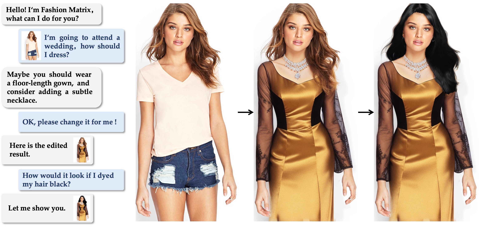

# Fashion Matrix: Editing Photos by Just Talking 
[](https://pytorch.org/)
[](https://opensource.org/licenses/MIT)

[[`Project page`](https://zheng-chong.github.io/FashionMatrix/)]
[[`ArXiv`](https://arxiv.org/abs/2307.13240)]
[[`PDF`](https://arxiv.org/pdf/2307.13240.pdf)]
[[`Video`](https://www.youtube.com/watch?v=1z-v0RSleMg&t=3s)]
[[`Demo(temporarily offline)`](https://0742dc8730a5a94a7a.gradio.live)]

Fashion Matrix is dedicated to bridging various visual and language models and continuously refining its capabilities as a comprehensive fashion AI assistant. 
This project will continue to update new features and optimization effects.

<div align="center">
  
</div>

## Updates
- **`2023/08/01`**: **Code** of v1.1 is released. The details are a bit different from the original version (Paper).
- **`2023/08/01`**: [**Demo(Label) v1.1**](https://0742dc8730a5a94a7a.gradio.live) with new *AI model* function and security updates is released.
- **`2023/07/28`**: Demo(Label) v1.0 is released.
- **`2023/07/26`**: [**Video**](https://www.youtube.com/watch?v=1z-v0RSleMg&t=3s) and [**Project Page**](https://zheng-chong.github.io/FashionMatrix/) are released.
- **`2023/07/25`**: [**Arxiv Preprint**](https://arxiv.org/abs/2307.13240) is released.

## Versions
**April 01, 2023**

*Fashion Matrix (Label version) v1.1*

We updated the use of ControlNet, currently using inpaint, openpose, lineart and (softedge).
+ Add the task **AI model**, which can replace the model while keeping the pose and outfits.
+ Add **NSFW (Not Safe For Work) detection** to avoid inappropriate using.


**July 28, 2023**

*Fashion Matrix (Label version) v1.0*
+ Basic functions: replace, remove, add, and recolor.

## Installation
You can follow the steps indicated in the [Installation Guide](INSTALL.md) for environment configuration and model deployment,
and models except LLM can be deployed on a single GPU with 13G+ VRAM.
(In the case of sacrificing some functions, A simplified version of Fashion Matrix can be realized without LLM. 
Maybe the simplified version of Fashion Matrix will be released in the future)


## Acknowledgement
Our work is based on the following excellent works:

 [Realistic Vision](https://civitai.com/models/4201/realistic-vision-v20) is a finely calibrated model derived from 
[Stable Diffusion](https://github.com/Stability-AI/stablediffusion) v1.5, designed to enhance the realism of generated 
images, with a particular focus on human portraits.
[ControlNet](https://github.com/lllyasviel/ControlNet-v1-1-nightly) v1.1 offers more comprehensive and user-friendly 
conditional control models, enabling
[the concurrent utilization of multiple ControlNets](https://huggingface.co/docs/diffusers/v0.18.2/en/api/pipelines/controlnet#diffusers.StableDiffusionControlNetPipeline).
This significantly broadens the potential and applicability of text-to-image techniques.
[BLIP](https://github.com/salesforce/BLIP) facilitates a rapid visual question-answering within our system.

[Grounded-SAM](https://github.com/IDEA-Research/Grounded-Segment-Anything) create a very interesting demo by combining
[Grounding DINO](https://github.com/IDEA-Research/GroundingDINO) and
[Segment Anything](https://github.com/facebookresearch/segment-anything) which aims to detect and segment anything with text inputs!
[Matting Anything Model (MAM)](https://github.com/SHI-Labs/Matting-Anything) is an efficient and
versatile framework for estimating the alpha matte ofany instance in an image with flexible and interactive
visual or linguistic user prompt guidance.
[Detectron2](https://github.com/facebookresearch/detectron2) is a next generation library that provides state-of-the-art 
detection and segmentation algorithms. The DensePose code we adopted is based on Detectron2.
[Graphonomy](https://github.com/Gaoyiminggithub/Graphonomy) has the capacity for swift and effortless analysis of 
diverse anatomical regions within the human body.


## Citation

```bibtex
 @misc{chong2023fashion,
      title={Fashion Matrix: Editing Photos by Just Talking},
      author={Zheng Chong and Xujie Zhang and Fuwei Zhao and Zhenyu Xie and Xiaodan Liang},
      year={2023},
      eprint={2307.13240},
      archivePrefix={arXiv},
      primaryClass={cs.CV}
    }
```